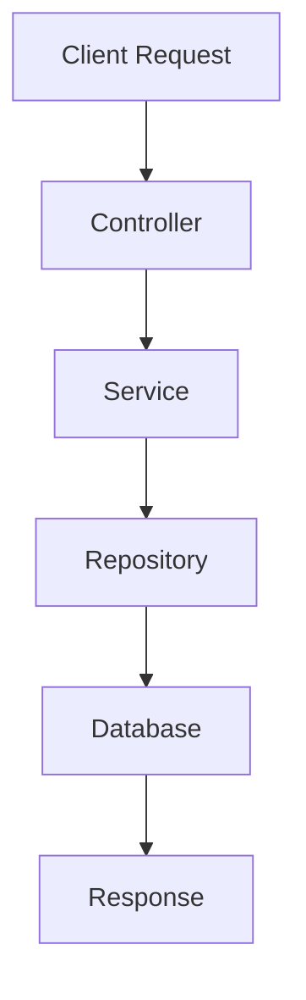

# Spring Framework Basics

This repository contains my learning notes and practical examples of Spring Framework Core concepts.

## Topics Covered

- Why Spring?
- Inversion of Control (IoC)
- Dependency Injection (DI)
- Spring Beans
- Spring Container
- @Component
- @Service
- @Repository
- @Controller
- @Configuration
- @Bean
- @Autowired
- Bean Lifecycle
- Constructor Injection
- Spring Framework Interview Questions
- Practice Exercises

---

## Why Spring?

As applications grow, manually creating and managing objects becomes difficult and leads to:

- Tight Coupling
- Difficult Testing
- Poor Maintainability

Spring solves these problems by managing objects and dependencies through the Spring Container.

---

## Inversion of Control (IoC)

IoC means the responsibility of creating and managing objects is transferred from the developer to the Spring Container.

### Traditional Java

```java
UserService userService = new UserService();
````

### Spring

```java
@Service
public class UserService {
}
```

Spring creates and manages the object automatically.

---

## Dependency Injection (DI)

Dependency Injection is a design pattern where Spring provides required dependencies to a class instead of the class creating them itself.

### Constructor Injection (Recommended)

```java
@Service
public class UserService {

    private final EmailService emailService;

    public UserService(EmailService emailService) {
        this.emailService = emailService;
    }
}
```

---

## Bean

A Bean is an object managed by the Spring Container.

```java
@Service
public class UserService {
}
```

---

## Spring Container

Responsibilities:

* Create Beans
* Manage Beans
* Inject Dependencies
* Handle Bean Lifecycle

---

## Common Spring Annotations

| Annotation     | Purpose                |
| -------------- | ---------------------- |
| @Component     | Generic Bean           |
| @Service       | Business Logic Layer   |
| @Repository    | Data Access Layer      |
| @Controller    | Request Handling Layer |
| @Configuration | Configuration Class    |
| @Bean          | Manual Bean Creation   |
| @Autowired     | Dependency Injection   |

---

## Complete Flow



